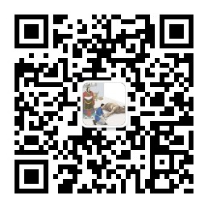

## slam 源码注释/分析包括:  

        1)cartographer  

        2)cartographer_ros  

        3)ros  

        4)ceres-solver    

        5)ORB_SLAM/ORB_SLAM2

        6)g2o

        7)rpg_svo/ SVO2.0

        8)rgbdslam_v2

        9)lsd_slam

        10)g2o

        11)...

slam 源码分析公众号,slamcode：

slam仓库不再更新关于cartographer的注释。cartographer的注释见：
https://github.com/learnmoreonce/cartographer
